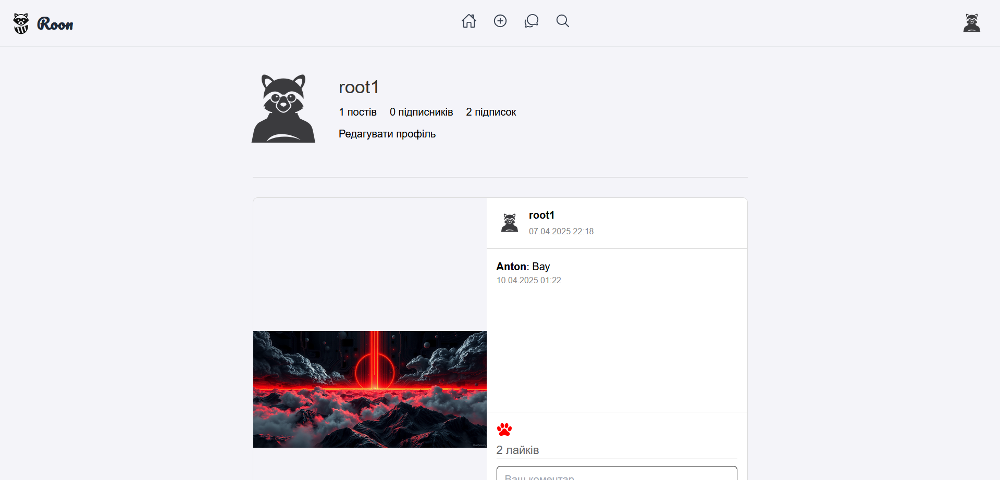

# Social_Media

Нова соціальна мережа з новітнім дизайном

> ## 📱 Соціальна мережа Roon
> 
> Створюйте публікації
> Знаходьте друзів
> Спілкуйтесь між собою
> ### Усе це - соціальна мережа Roon

### ✔️ Встановлення та залежності:

```powershell
git clone https://github.com/AntonUniatitskyi/Social_Media
cd Social_Media
pip install -r requirements.txt
copy .env.example .env
```
###### Заповніть файл .env

#### 🌐 Для запуску сервера виконайте команди:

```powershell
python manage.py makemigrations
python manage.py migrate
python manage.py runserver
```

#### 🌐 Docker
##### Білд:
```console
docker build . -t social_media:1.1.1
```
##### Запуск:
```console
docker run -p 8000:8000 social_media:1.1.1
```
Після цього, буде доступно за посиланням http://0.0.0.0:8000
